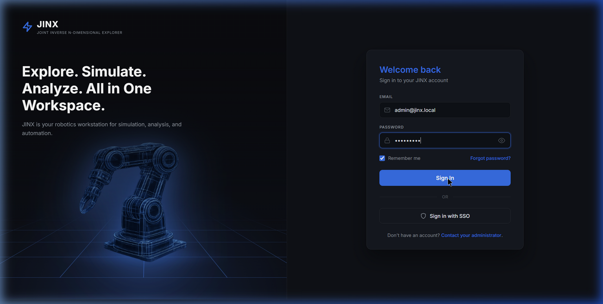
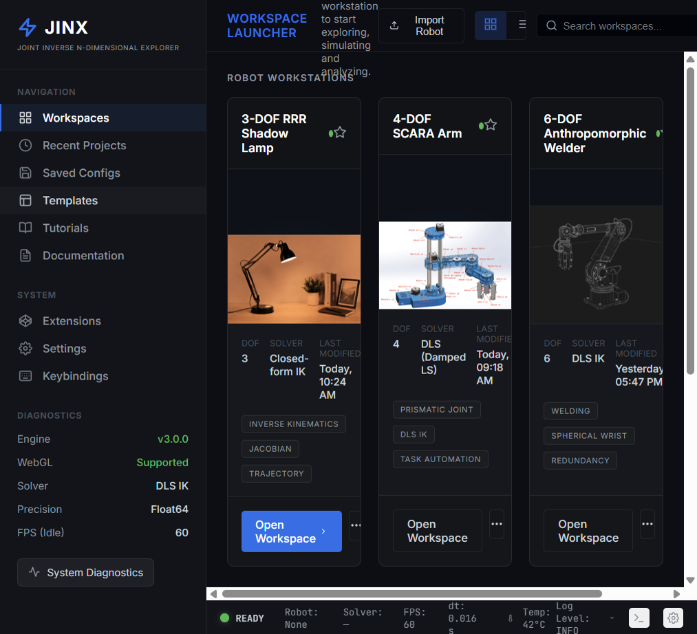
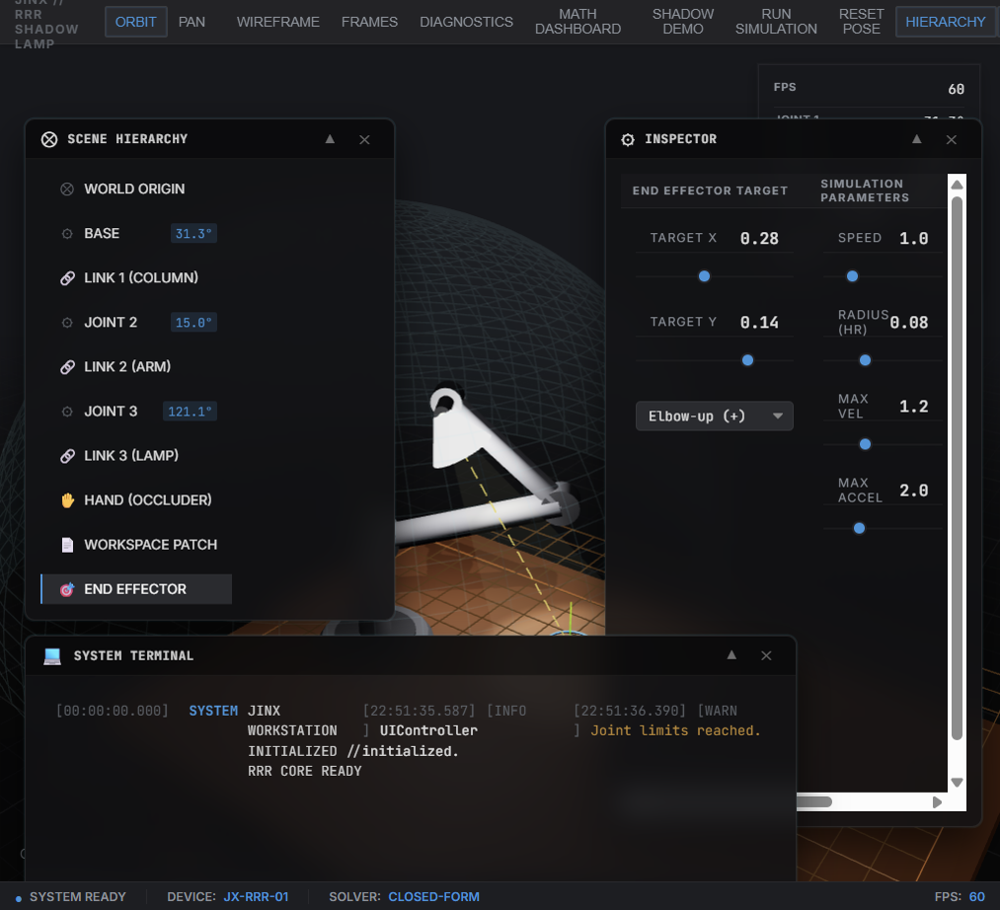
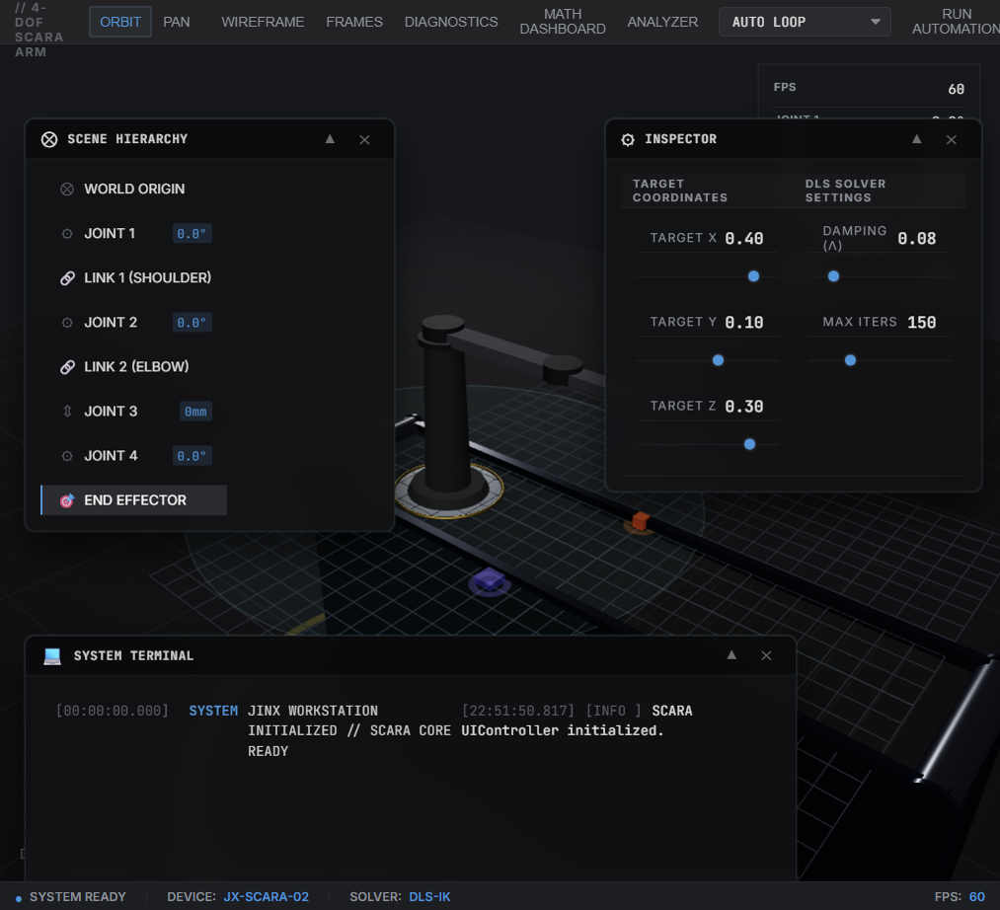
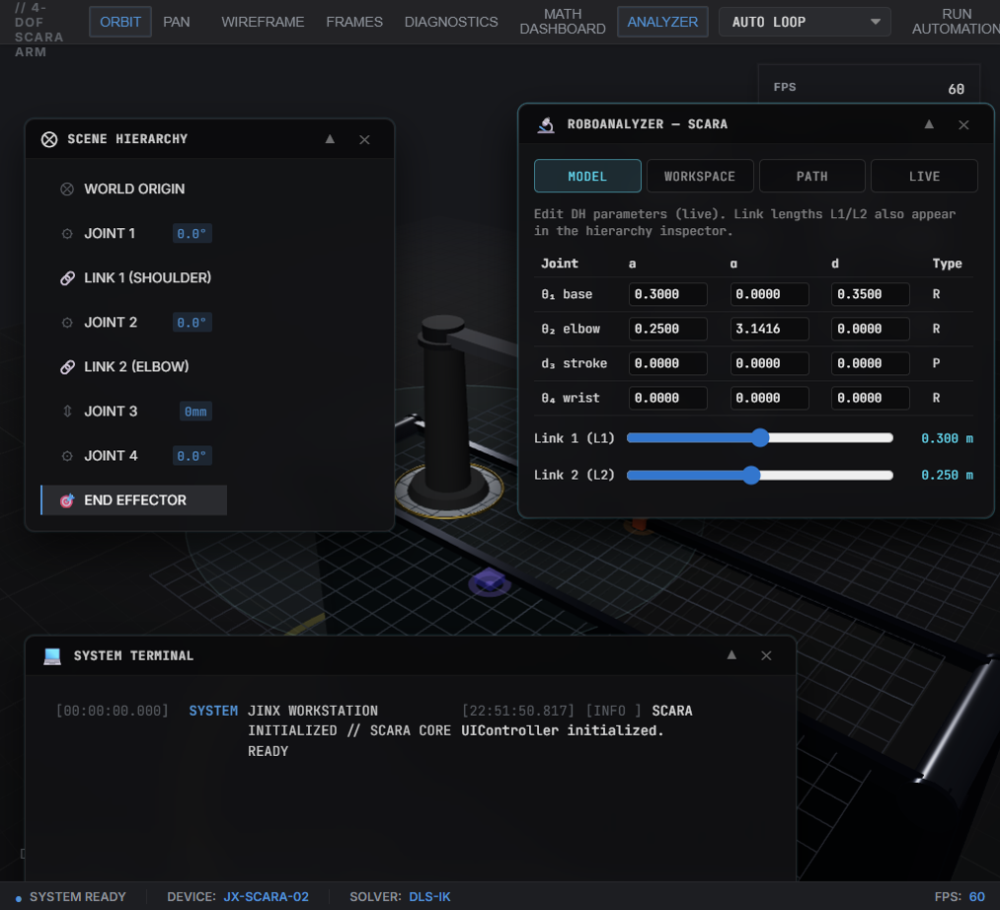
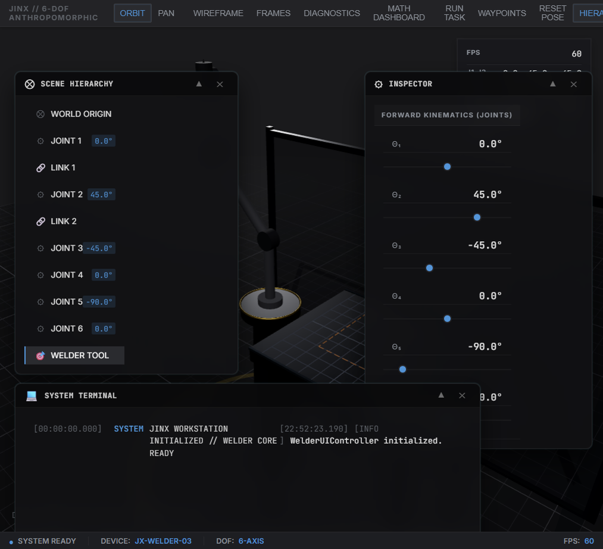

# JINX: Joint Inverse N-dimensional eXplorer

A browser-based, real-time 3D simulator for exploring robotic manipulator
kinematics, Jacobian analysis, singularity detection, and task-space trajectory
planning. Built with Three.js, vanilla JavaScript, and Vite.

**Live demo (GitHub Pages):**  
[https://chandansaipavanpadala.github.io/jinx/](https://chandansaipavanpadala.github.io/jinx/)

| Demo sign-in (hosted build) | |
|---|---|
| Email | `admin@jinx.local` |
| Password | `Jinx@2026` |

> Hosted accounts are stored in your browser only (not on a server). Local `npm run dev` credentials use the same demo values from `.env.development`.

---

## Screenshots

### Sign-in & workspace launcher

Secure workstation login and the main hub for opening robot simulators.

| Login | Workspace launcher |
|:---:|:---:|
|  |  |

### 3-DOF RRR shadow lamp

Closed-form IK, Jacobian diagnostics, shadow-avoidance demo, and pinhole camera model.



### 4-DOF SCARA pick & place

DLS inverse kinematics, pick-and-place automation, link resizing, and **RoboAnalyzer** (DH editor, workspace sampling, joint paths).

| SCARA workspace | RoboAnalyzer panel |
|:---:|:---:|
|  |  |

### 6-DOF welding cell

Waypoint paths, welding task execution, and spark effects.




---

## Table of Contents

1. [Project Overview](#project-overview)
2. [Screenshots](#screenshots)
3. [Supported Robot Configurations](#supported-robot-configurations)
4. [Core Architecture](#core-architecture)
5. [Mathematical Foundations](#mathematical-foundations)
6. [Math Dashboard](#math-dashboard)
7. [Directory Structure](#directory-structure)
8. [Local Development Setup](#local-development-setup)
9. [GitHub Pages Deployment](#github-pages-deployment)
10. [License](#license)

---

## Project Overview

JINX provides an interactive environment for studying serial manipulator
kinematics without requiring MATLAB, ROS, or compiled simulation software.
The simulator runs entirely in the browser and supports:

- Closed-form and iterative inverse kinematics (DLS solver for N-DOF chains)
- Real-time Jacobian computation with color-coded matrix visualization
- Singularity detection and manipulability index tracking
- Trapezoidal velocity profiling with configurable limits
- Pinhole camera model with intrinsic/extrinsic parameter tuning
- Pick-and-place task automation with finite state machine control
- Waypoint-based trajectory planning for welding path execution
- **RoboAnalyzer** workbench on SCARA (DH model, workspace slice, joint-space paths)
- Modular persistence layer (users, sessions, workspaces) via `src/database/`
- Inter-tab communication via BroadcastChannel for live math dashboard sync
- Interactive link resizing with real-time kinematic mesh updates
- Real-time 3D rendering with PBR materials, shadow mapping, and environment lighting

---

## Supported Robot Configurations

| Configuration              | DOF | Joint Types | Key Features                                      |
|----------------------------|-----|-------------|---------------------------------------------------|
| 3-DOF RRR Desk Lamp        | 3   | RRR         | Closed-form IK, occlusion avoidance, camera model |
| 4-DOF SCARA Arm             | 4   | RRPR        | DLS IK, pick-and-place FSM, RoboAnalyzer, link resize |
| 6-DOF Welding Robot         | 6   | 6R          | DLS IK, welding spark effects, waypoint paths     |

All three configurations share a unified N-DOF kinematics engine
(`KinematicsNDOF.js`) that computes forward kinematics, the 6×N geometric
Jacobian, and damped least-squares inverse kinematics for arbitrary serial
chains defined by standard DH parameter tables.

---

## Core Architecture

The codebase follows a strict separation of concerns:

```
index.html / login.html           Auth + workspace launcher
src/pages/*.html                  Per-robot simulator pages
src/math/                         Pure kinematics (no DOM)
src/core/                         Three.js scene managers
src/ui/                           HUD, panels, controllers
src/model/ + src/analysis/        Robot definitions + RoboAnalyzer
src/database/                     Storage drivers + repositories
src/logic/                        Task FSMs (pick-place, welding, waypoints)
src/config/                       App config (Vite env)
public/                           CSS, images, static assets
docs/screenshots/                 README gallery images
```

### Data Flow

```
  User Input (sliders / drag / task FSM)
       |
       v
  UIController._updateScene()
       |
       +---> fk(q, dhTable)              [src/math/KinematicsNDOF.js]
       +---> ik_dls(target, q, dhTable)  [src/math/KinematicsNDOF.js]
       +---> jacobian(q, dhTable)        [src/math/KinematicsNDOF.js]
       +---> trapProfile()               [src/math/Trajectory.js]
       |
       v
  SceneManager.updateScene(q, pTarget)   [src/core/*SceneManager.js]
       |
       +---> DH chain FK for mesh positioning
       +---> Mesh repositioning (joints, links, end-effector)
       +---> Trail rendering, spark effects (welder)
       |
       v
  BroadcastChannel('jinx_math_sync')
       |
       v
  Math Dashboard (separate tab)          [src/pages/math-dashboard.html]
```

---

## Mathematical Foundations

### Denavit-Hartenberg Convention

All robots use the standard DH convention. Each joint *i* is parameterized by
link length *aᵢ*, link twist *αᵢ*, link offset *dᵢ*, and joint angle *θᵢ*.

### 3-DOF RRR Desk Lamp

| i | aᵢ (m) | αᵢ | dᵢ (m) | θᵢ |
|---|--------|-----|--------|-----|
| 1 | 0 | π/2 | 0.15 | θ₁* |
| 2 | 0.30 | 0 | 0 | θ₂* |
| 3 | 0.24 | 0 | 0 | θ₃* |

Uses closed-form forward and inverse kinematics (`Kinematics.js`).

### 4-DOF SCARA Arm

| i | aᵢ (m) | αᵢ | dᵢ (m) | θᵢ |
|---|--------|-----|--------|-----|
| 1 | 0 | 0 | 0.35 | θ₁* |
| 2 | 0.35 | π | 0 | θ₂* |
| 3 | 0 | 0 | d₃* | 0 |
| 4 | 0 | 0 | 0 | θ₄* |

Uses damped least-squares (DLS) iterative IK.

### 6-DOF Welding Robot

Six revolute joints with a spherical wrist; DLS IK and waypoint-based welding paths.

### Analytical Jacobian

The 6×N geometric Jacobian **J(q)** maps joint velocities to Cartesian velocities.
Manipulability index **μ = √(det(JᵥJᵥᵀ))** indicates proximity to singularities.

### Damped Least-Squares IK

**Δq = Jᵀ (J Jᵀ + λ² I)⁻¹ e** for chains without closed-form IK.

### Trapezoidal Velocity Profile

Normalized trapezoidal (or triangular) motion profiles in `Trajectory.js`.

---

## Math Dashboard

The Math Dashboard (`src/pages/math-dashboard.html`) opens in a separate tab and
receives live telemetry from any running simulator via `BroadcastChannel`.

- **Forward kinematics** — EE position, joint cards, DH table
- **Inverse kinematics** — target sliders, convergence error, iteration count
- **Jacobian** — color-coded matrix, manipulability, singularity warnings
- **Analytics** — Chart.js error, velocity, and manipulability time series

Open from a workspace toolbar (**MATH DASHBOARD**) or directly:

`src/pages/math-dashboard.html?robot=scara` (also `rrr`, `welder`)

---

## Directory Structure

```
jinx/
├── index.html                  Workspace launcher (auth required)
├── login.html                  Sign-in / profile setup
├── docs/screenshots/           README images
├── public/                     Global CSS, images, favicon
├── src/
│   ├── config/                 appConfig, storage keys
│   ├── database/               Drivers + repositories
│   ├── model/                  RobotModel, ScaraModel
│   ├── analysis/               WorkspaceSampler, PathAnimator
│   ├── math/                   Kinematics, Trajectory, CameraModel
│   ├── core/                   SceneManager (RRR, SCARA, Welder)
│   ├── ui/                     Controllers, panels, analyzer
│   ├── logic/                  PickAndPlace, WeldingTask, Waypoints
│   ├── auth/                   AuthService, guards
│   └── pages/                  Simulator + math dashboard HTML
├── .env.example                Environment variable reference
├── .env.production             Demo seed for GitHub Pages builds
└── vite.config.js              Multi-page Vite config
```

---

## Local Development Setup

### Prerequisites

- Node.js 18+
- npm 9+

### Installation

```bash
git clone https://github.com/chandansaipavanpadala/jinx.git
cd jinx
npm install
```

### Development Server

```bash
npm run dev
```

Open the URL printed by Vite (includes the repo base path), e.g.:

`http://localhost:5173/jinx/`

Sign in with the credentials from `.env.development` (default: `admin@jinx.local` / `Jinx@2026`).

### Production Build

```bash
npm run build
npm run preview
```

---

## GitHub Pages Deployment

The project deploys via `.github/workflows/static.yml` on pushes to `main`.

1. Enable **GitHub Pages** → source: **GitHub Actions**.
2. Push to `main`; the workflow runs `npm run build` and publishes `dist/`.
3. Visit  
   `https://<username>.github.io/jinx/`

**Sign-in on Pages:** use the demo account in the table at the top, or choose **Create your profile** on first visit (data stays in that browser only).

Environment variables:

| File | Purpose |
|------|---------|
| `.env.development` | Local dev seed (gitignored) |
| `.env.production` | Demo seed baked into Pages build |
| `.env.example` | Documented template |

To change the hosted demo password, edit `.env.production` and redeploy, or set the `JINX_DEMO_PASSWORD` secret in GitHub Actions (see workflow comments).

---

## License

This project is released under the MIT License. See [LICENSE](LICENSE) for full terms.
